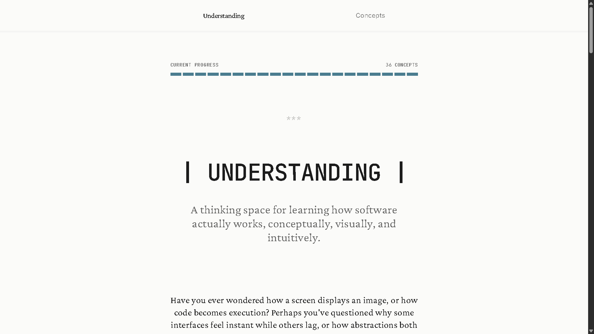
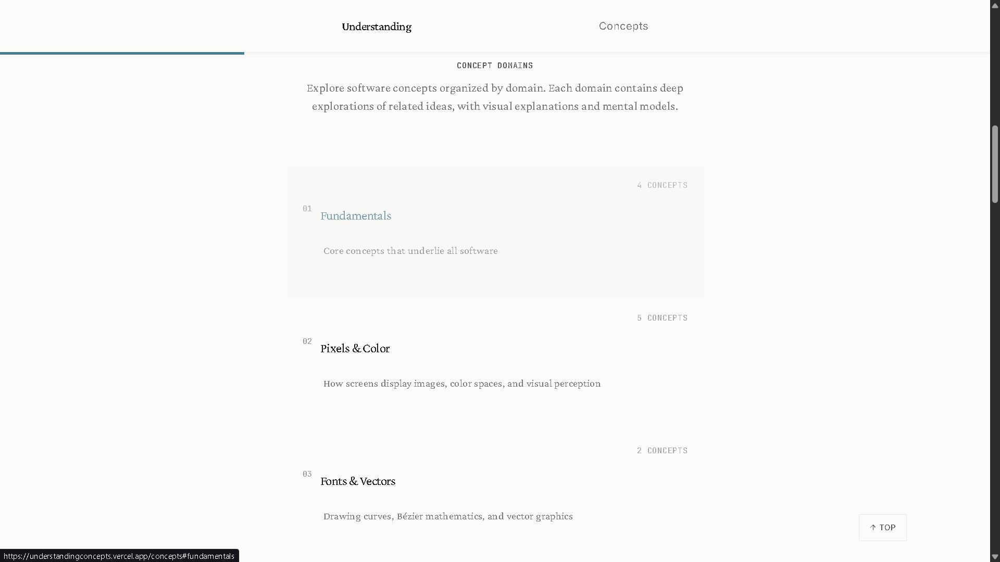
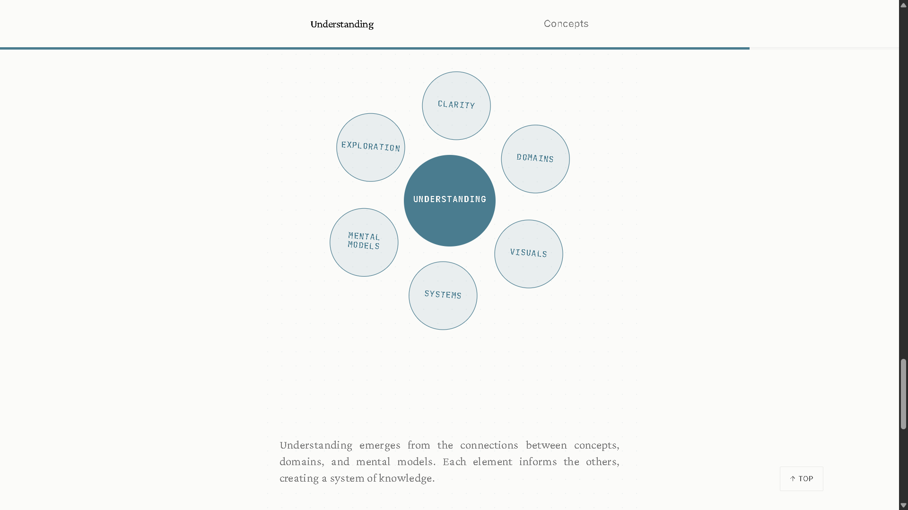
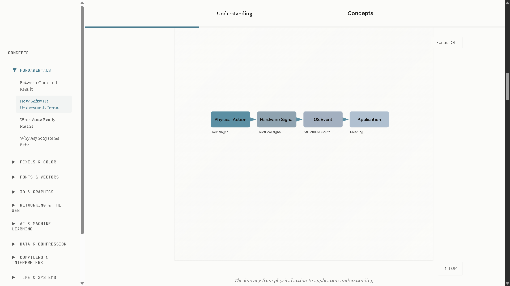
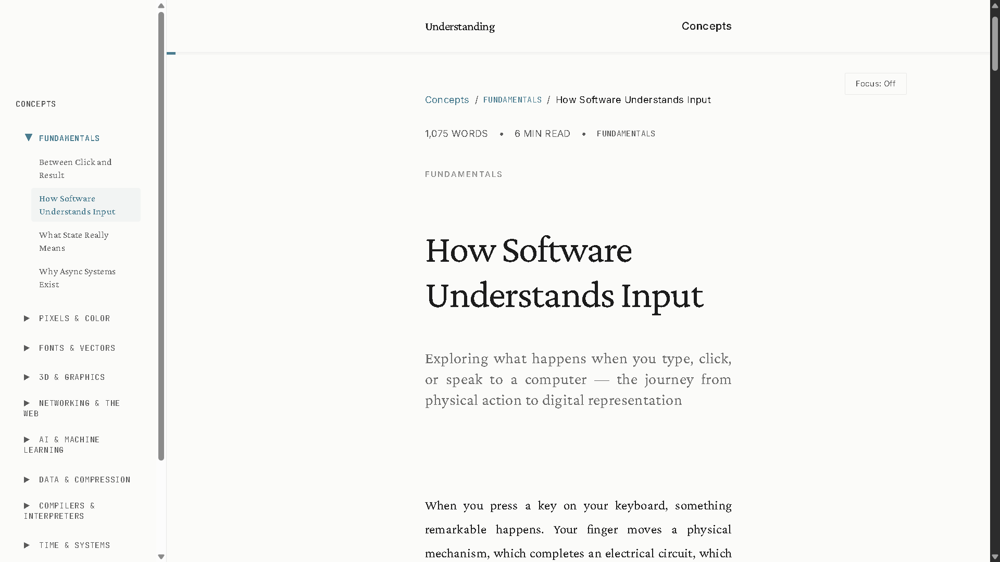

# Understanding

**A thinking space for learning how software actually works** — conceptually, visually, and intuitively.

[](https://nextjs.org/)
[](https://www.typescriptlang.org/)
[](https://tailwindcss.com/)

---

## Overview

Understanding is **not** a blog, tutorial site, or documentation hub. It is a **thinking space** — a calm, intellectually rich environment for understanding software at a fundamental level. Each concept is explored deeply with visual explanations and mental models, so you understand systems, not just use them.

---

## Screenshots

### Landing

<p align="center">
  
</p>

### Concept pages & visuals

<p align="center">
  
</p>

<p align="center">
  
</p>

### Diagrams & explanations

<p align="center">
  
</p>

<p align="center">
  
</p>

<p align="center">
  
</p>

---

## Features

| Feature | Description |
|--------|--------------|
| **Focus Mode** | Reading tunnel that dims content around your reading position; spotlight follows scroll. |
| **Concept Connections** | Sidebar shows related concepts as you read for discovery and context. |
| **Progressive Reveals** | Content fades in on scroll for a calm, book-like experience. |
| **Visual Explanations** | Every concept includes at least one explanatory diagram (SVG-based). |
| **Domain-Based Organization** | Concepts grouped into domains (Pixels & Color, Fonts & Vectors, 3D & Graphics, etc.). |
| **Minimalist Design** | Serif reading font, generous spacing, no dashboards or SaaS clutter. |

---

## Tech Stack

- **Framework:** [Next.js 14](https://nextjs.org/) (App Router)
- **Language:** [TypeScript](https://www.typescriptlang.org/)
- **Styling:** [Tailwind CSS](https://tailwindcss.com/)
- **Content:** [MDX](https://mdxjs.com/) with `next-mdx-remote`
- **Syntax:** `remark-gfm`, `rehype-highlight`, `rehype-slug`, `rehype-autolink-headings`

---

## Getting Started

### Prerequisites

- **Node.js** 18+
- **npm** or **yarn**

### Installation

```bash
# Clone the repository
git clone <your-repo-url>
cd Understanding

# Install dependencies
npm install

# Start development server
npm run dev
```

Open [http://localhost:3000](http://localhost:3000) in your browser.

### Production build

```bash
npm run build
npm start
```

Runs on port **8080** by default.

---

## Project Structure

```
Understanding/
├── app/                    # Next.js App Router
│   ├── concepts/[slug]/    # Dynamic concept pages
│   ├── layout.tsx
│   └── page.tsx            # Landing page
├── components/             # React components
│   ├── diagrams/           # Diagram primitives & patterns
│   ├── visuals/            # Concept-specific SVG diagrams
│   ├── FocusMode.tsx       # Reading tunnel effect
│   ├── ConceptConnections.tsx
│   ├── MdxContent.tsx
│   └── ...
├── content/concepts/       # MDX concept files
├── lib/                    # Utilities
│   ├── concepts.ts         # Concept loading & metadata
│   ├── domains.ts         # Domain definitions
│   └── mdx.ts             # MDX processing
└── public/assets/         # Images & static assets
```

---

## Adding New Concepts

1. Create a new `.mdx` file in `content/concepts/`.
2. Add frontmatter and content:

```mdx
---
title: "Your Concept Title"
description: "A brief description for cards and SEO"
category: "Category Name"
related: ["related-concept-slug"]
---

Your content here. Use MDX for components and Markdown for text.
```

3. Optionally add a custom diagram in `components/visuals/` and reference it from the MDX.

---

## Scripts

| Command | Description |
|--------|-------------|
| `npm run dev` | Start development server (port 3000) |
| `npm run build` | Production build |
| `npm start` | Run production server (port 8080) |
| `npm run lint` | Run ESLint |

---

## Philosophy

- **Understanding over instructions** — One deep idea per concept; no step-by-step tutorials.
- **Visuals that explain** — Diagrams support the narrative; they are not decoration.
- **Calm, confident design** — Off-white, soft black, generous whitespace, book-like typography.
- **Static-first** — Fast, SEO-friendly, responsive, with reduced-motion and accessibility in mind.

For more on goals and structure, see [PROJECT.md](./PROJECT.md).

---

## Contributing

Contributions are welcome. If you’d like to improve a concept, fix a bug, or add a new idea:

1. **Fork** the repository and clone it locally.
2. Create a **branch** for your change (`git checkout -b improve/some-concept`).
3. Make your edits (concepts in `content/concepts/`, components in `components/`).
4. **Commit** with a clear message and **push** to your fork.
5. Open a **Pull Request** against the main repository with a short description of the change.

For new concepts, follow the structure in [Adding New Concepts](#adding-new-concepts). Keep the tone calm, explanatory, and focused on understanding rather than step-by-step instructions.

---

## Author

**Gaurav Jain**

| Link | URL |
|------|-----|
| **Portfolio** | [gauravjain.tech](https://www.gauravjain.tech/) |
| **Twitter / X** | [@gauravjain0377](https://x.com/gauravjain0377) |
| **GitHub** | [@gauravjain0377](https://github.com/gauravjain0377) |
| **LinkedIn** | [this-is-gaurav-jain](https://www.linkedin.com/in/this-is-gaurav-jain/) |

---

## License

Private project. All rights reserved.

